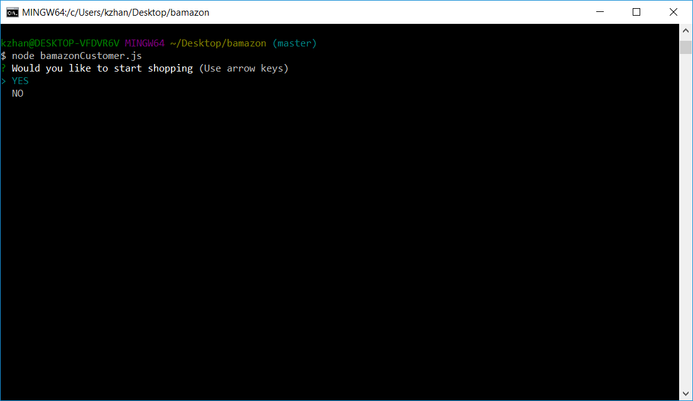
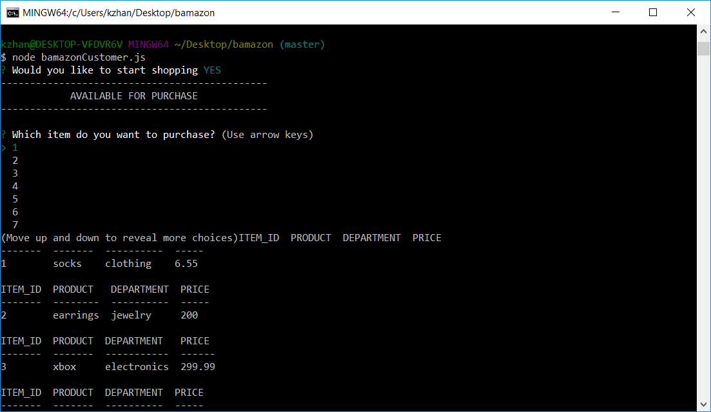
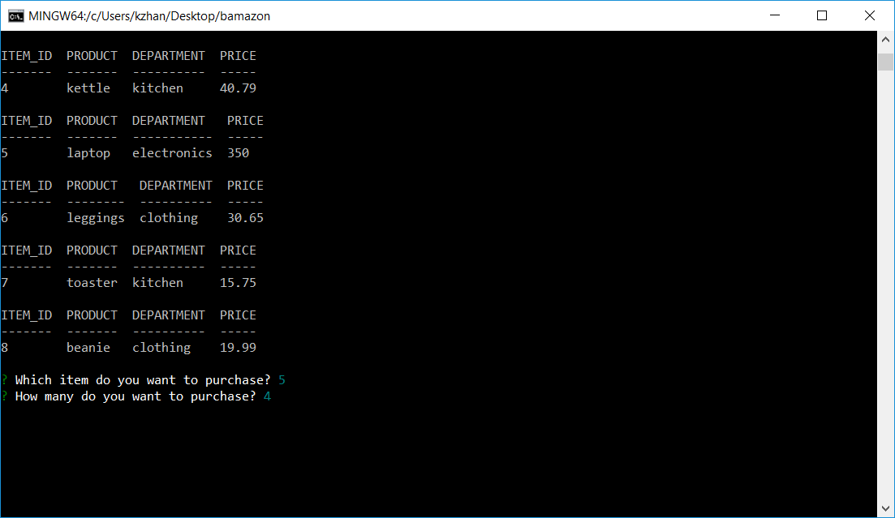

# Bamazon

Bamazon is a shopping platform that is accesible on the command line. The user is able to look through and inventory
of products and make a purchase. All of the product information is displayed through connecting the application to a mySQL database. 
This connection also allows the stock quantities to be updated as products are purchased. 

# Demonstration

